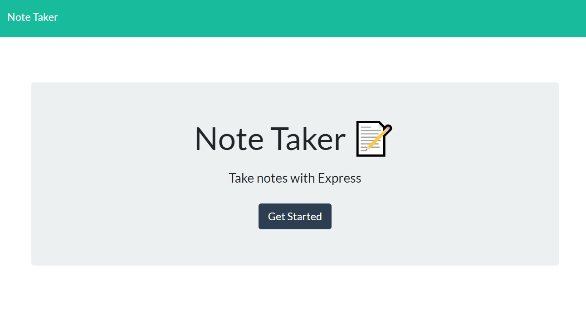
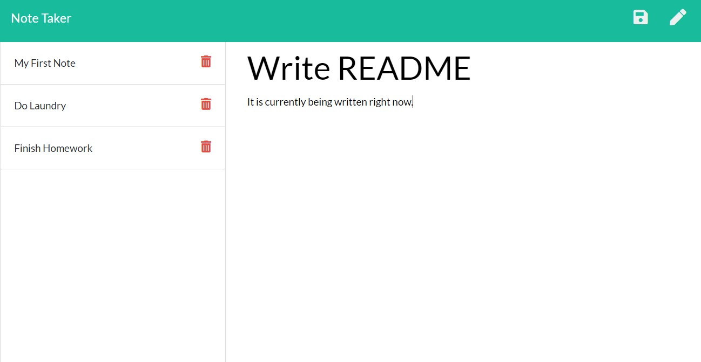
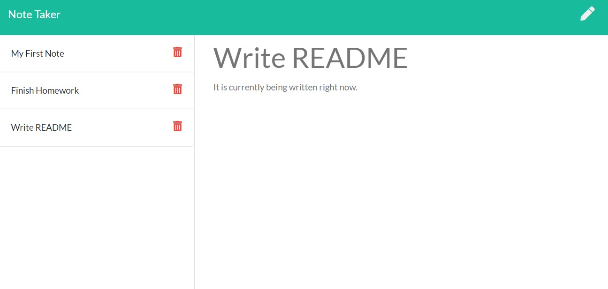

# noteTaker

Homework11 - Makoto Asahi

Deployed heroku link: 
https://pure-gorge-17986.herokuapp.com/

# Description
This app will allow users to write notes on the page and save them.

Revisiting the page will load all saved notes on the left column.

Users can display the notes by clicking on them, or delete them with the trash button.

> Note that currently, anyone can save and delete notes. Please be courteous to other users.

# Installation

This app is also functional by downloading and locally hosting a server.

`express` and `uuid` are required to run this app.

They can both be installed by running `npm i` in the terminal after downloading.

`node.js` is required to host locally.

`heroku` is required to be hosted as a live page.

# Usage

Once downloaded, users can locally host the server by running `server.js` in node.

> node server.js

`ctrl + c` will exit out of the server hosting.

Notes are stored in the db folder under db.json.

